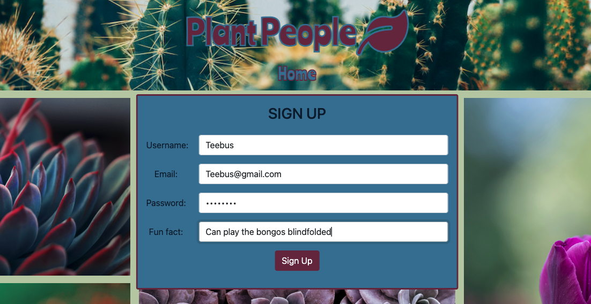
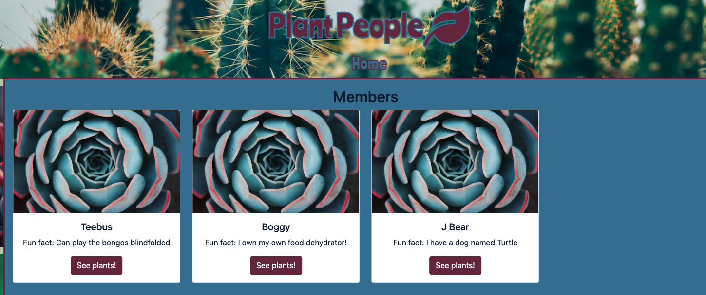
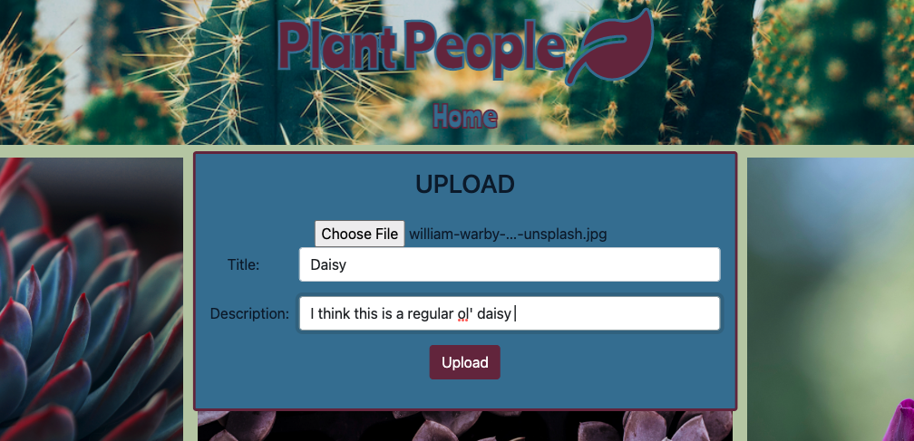

# Plant People

Sign up to add pictures of plants to your profile and view other members' plants.

## Description

A simple applicaton to upload pictures of plants that include a title and description to be displayed in card-format on your member profile. User is presented with a login/signup page as the homepage. Either of those actions takes you to the members page with cards of each member, including a picture, their username, and a "fun fact".

## Dependencies

Necessary dependencies can be found in the package.json file. They include sequelize, express, mysql2, and a few others
On a local machine, the mySQL database (with plants_db) needs to be initialized before the server.

## Executing program

To start the application
run either:

```
node server.js
```

or to use nodemon:

```
npm run start
```

## Authors

Tyler Brooks
<br>
[Thetylerbrooks@gmail.com](mailto:Thetylerbrooks@gmail.com)

## Future addidtions

User should only be allowed to add pictures to the profile that they are singed in as.

Add an option to choose a profile picture and/or Fontawesome icon to your member card.

## Screenshots

HOMEPAGE


SIGNUP


MEMBERS PAGE


INDIVIDUAL MEMBER PAGE


UPLOAD FORM

